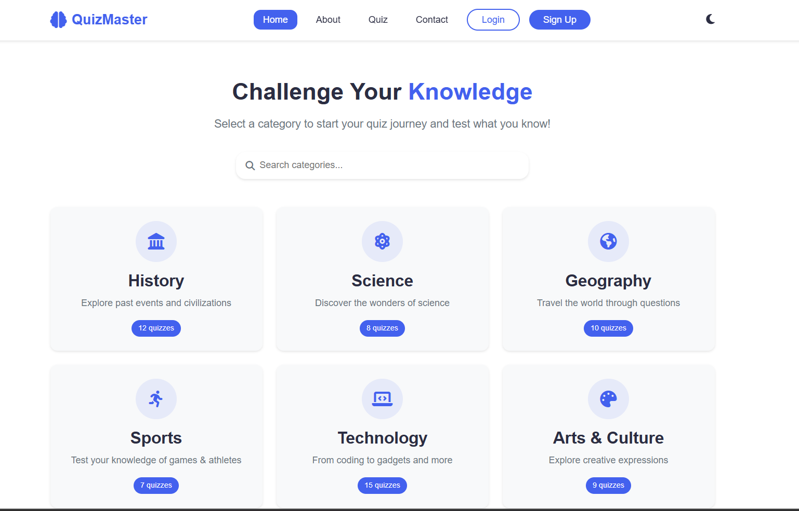
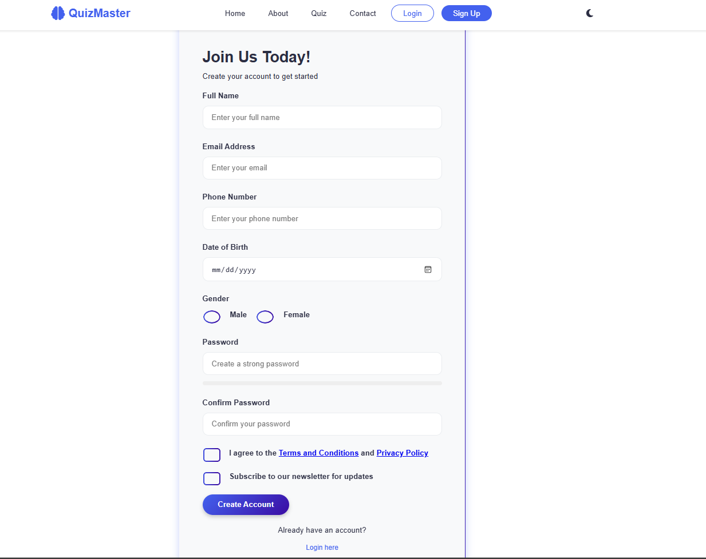
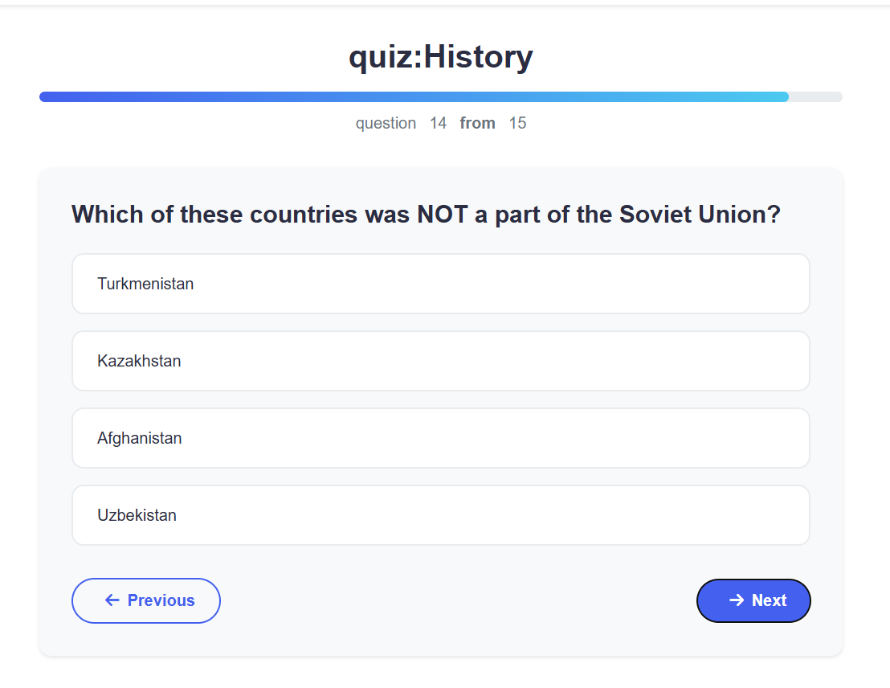
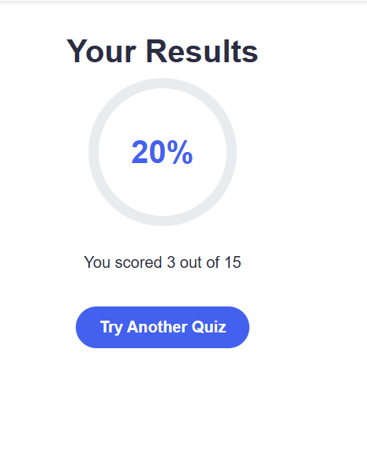
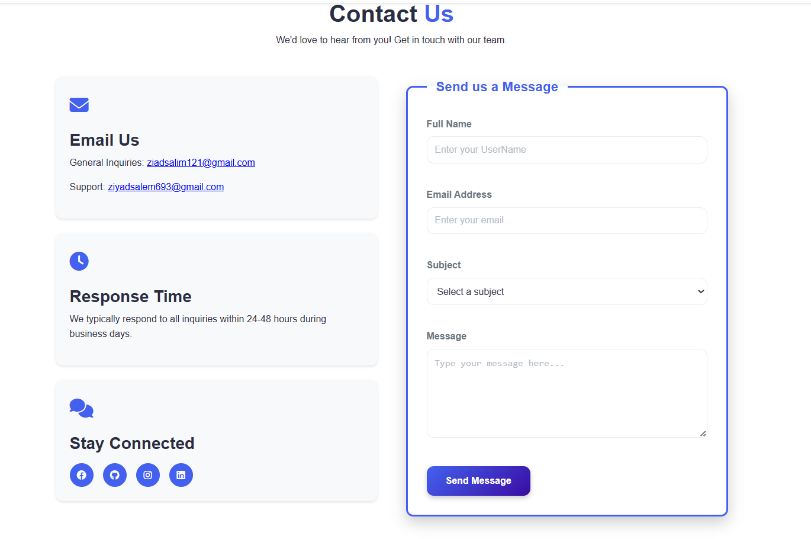
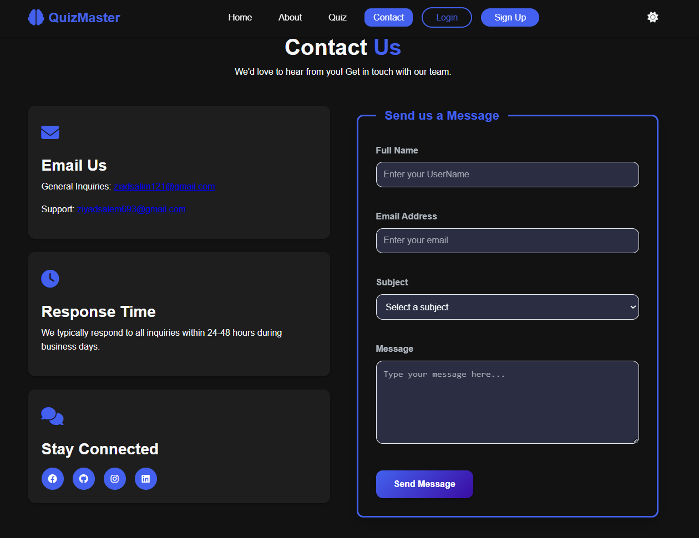

# 🧠 QuizMaster – Test Your Knowledge


## 📋 Overview

QuizMaster is a modern and fully responsive web-based quiz application built using **Vanilla JavaScript**. It allows users to test their knowledge across multiple categories with a smooth user experience, authentication system, API integration, and progress tracking.

---

## 🎮 Screenshots










## ✨ Key Features

* 🎯 **6 Quiz Categories**
  History, Science, Geography, Sports, Technology, and Arts

* 🌓 **Light & Dark Mode Support**

* 🔐 **Secure Authentication**

  * Login & Account creation
  * SHA-256 hashing with unique salts
  * Local Storage for user data

* 📊 **Statistics & Score Tracking**

* ⚡ **SPA Navigation**
  Smooth page switching with hash routing

* 🔍 **Smart Search**
  Quickly locate available quiz categories

* 🎨 **Responsive UI**
  Works perfectly on phones, tablets, and desktops

---

## 🚀 Getting Started

### ✔ Requirements

* Modern web browser (Chrome, Firefox, Safari, Edge)
* Internet connection (for fetching quiz questions)

### 📥 Installation

Clone the repository:

bash
git clone https://github.com/z2yad/QuizMaster.git
cd QuizMaster


Run the app:

bash
# Just open index.html in your browser

# OR via VS Code:
# Run using Live Server extension


---

## 📂 Project Structure


QuizMaster/
├── screenshots/    # Screenshots folder
├── index.html      # Main HTML file
├── app.js          # Core application logic
├── style.css       # Application styles and themes
└── README.md       # Documentation


---

## 🎯 How to Use

### 1️⃣ Create an Account

* Click **Sign Up**
* Fill in:

  * Full name
  * Email
  * Password
  * Phone number
  * Date of birth
* Password strength is validated
* Submit to create account

### 2️⃣ Log In

* Click **Login**
* Enter registered credentials

### 3️⃣ Start a Quiz

* Select a category card
* Click **Start Quiz**
* Navigate using:

  * *Next*
  * *Previous*
  * *Submit*

### 4️⃣ View Results

After finishing a quiz, users can see:

* Score percentage
* Number of correct answers
* Total number of questions

---

## 🛠 Technical Details

### 💻 Frontend Technologies

* **HTML5**

* **CSS3**

  * CSS Variables
  * Flex/Grid Layouts
  * Animations
  * Fully responsive design

* **JavaScript (ES6+)**

  * Async/Await
  * Web Crypto API
  * Local Storage
  * SPA routing

### 📦 External Libraries

* FontAwesome 6.4.0
* Google Fonts (Poppins)
* Navigo 7.1.2

### 🌐 API

Questions are retrieved from the **Open Trivia Database**:

```
https://opentdb.com/api.php
```

Supports multiple categories and difficulty levels.

---

## 🔒 Security

### Password Hashing (SHA-256)

```js
function generateSalt(bytes = 16) {
  const arr = new Uint8Array(bytes);
  crypto.getRandomValues(arr);
  return Array.from(arr, byte =>
    byte.toString(16).padStart(2, '0')
  ).join('');
}
```

Validations include:

* Email verification
* Password strength
* Password confirmation
* Egyptian phone validation
* Date of birth validation

---

## 📱 Responsive Design

### Breakpoints

* `< 576px` — Mobile
* `576–768px` — Tablet
* `768–992px` — Desktop
* `> 992px` — Large Displays

### Responsive Features

* Collapsible hamburger menu
* Auto-scaling category cards
* Full-width controls on small screens

---

## 🐛 Error Handling

### API Fetch Errors

```js
try {
  const response = await fetch(api_url);
  if (!response.ok) throw new Error("Network response was not ok");
  const data = await response.json();
  return data.results;
} catch (error) {
  console.error("Error fetching questions:", error);
}
```

### Form Validation

* Clear error messages
* Highlighting invalid fields
* Preventing submission when invalid

---

## 🚧 Future Enhancements

* Real backend with a database
* Global ranking & leaderboard
* Share results on social media
* Custom user-submitted questions
* Gamification system
* Full Arabic support
* Mobile apps (Android & iOS)

---

## 🤝 Contributing

Contributions are welcome!

```bash
fork the repo
git checkout -b feature/NewFeature
git commit -m "Add new feature"
git push origin feature/NewFeature
open a pull request
```

---

## 📞 Contact

**Author:** Zeyad Salim

* Email: `ziadsalim121@gmail.com`
* GitHub: `@z2yad`
* Instagram: `@zeyad_ssalem`
* LinkedIn: `https://www.linkedin.com/in/zeyad-salim/`

---

## 📄 License

This project is licensed under the **MIT License**.

---

<div align="center">
Made with ❤ by <b>Zeyad Salim</b><br>
If you like the project, please give it a ⭐
</div>
